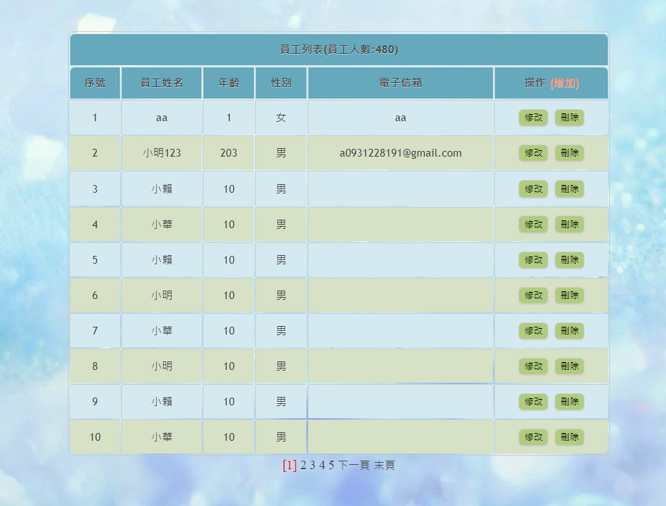
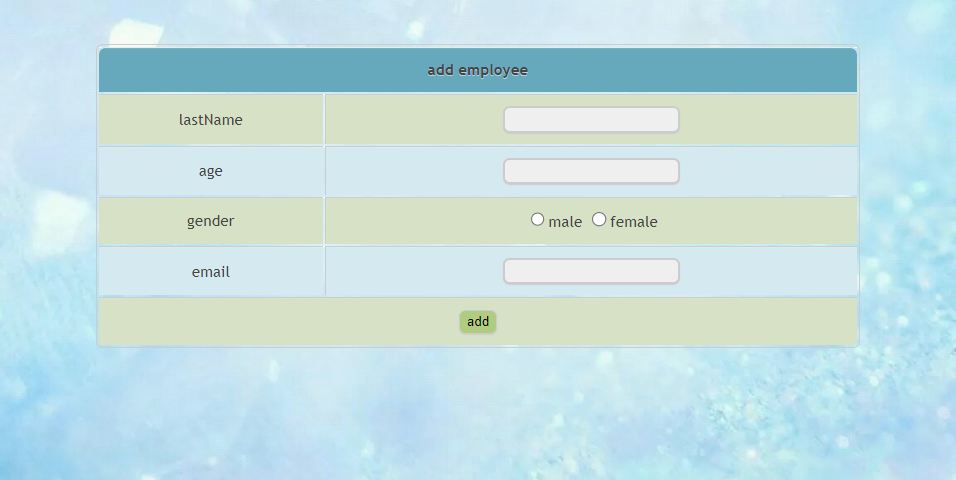
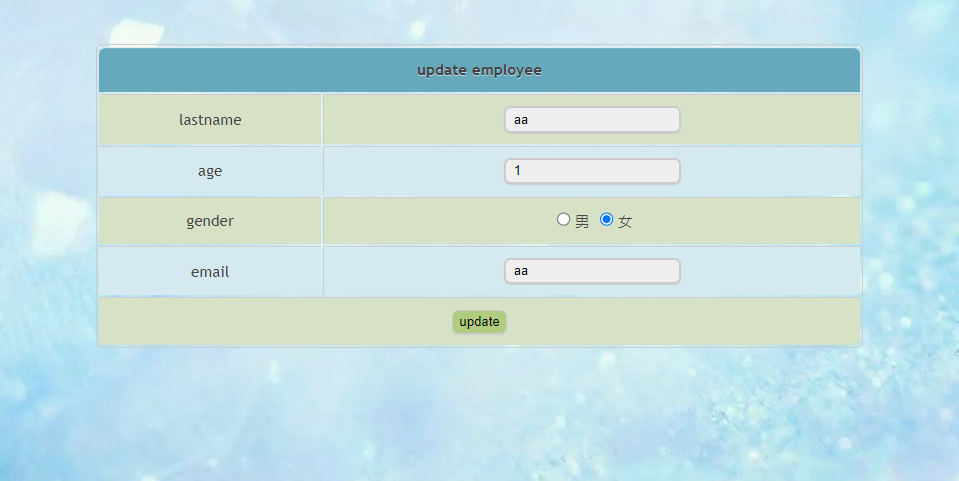

# SSM-Framework-Project
SSM CRUD Operation

## Frame work
- Spring
- Spring MVC
- Mybatis

## feature
- create employee
- update employee
- delete employee
- Pagination

## data base

| Column Name |  Data Type  | Not Null | Auto Increment | Ket |     Extra      |
|:-----------:|:-----------:|:--------:| -------------- |:---:|:--------------:|
|   emp_id    |   int(50)   |   YES    | YES            | PRI | auto_increment |
|  emp_name   | varchar(50) |    NO    | NO             |     |                |
|     age     |   int(11)   |    NO    | NO             |     |                |
|   gender    |   char(1)   |    NO    | NONO           |     |                |
|    email    | varchar(50) |    NO    | NO             |     |                |

 

